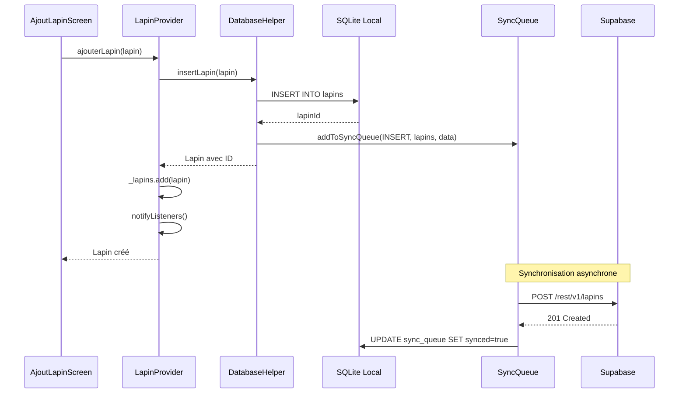

# 🐇 Flux : Ajouter un Lapin

Ce document décrit le flux technique et métier pour ajouter un nouveau lapin dans BunnyManager.

## Diagramme de Flux



## Étapes Détaillées

### 1. Interface Utilisateur

**Fichier** : `lib/screens/cheptel/ajout_lapin_screen.dart`

L'utilisateur remplit le formulaire :

- Nom (obligatoire)
- Race (sélection ou saisie libre)
- Sexe (Mâle/Femelle)
- Date de naissance
- Poids (optionnel)
- Localisation (cage/clapier)

### 2. Provider (État)

**Fichier** : [lapin_provider.dart](file:///c:/Users/GUIFO/Desktop/rabbit_farm_app/lib/providers/lapin_provider.dart)

```dart
Future<Lapin> ajouterLapin(Lapin lapin) async {
  final lapinAjoute = await _db.insertLapin(lapin);
  _lapins.add(lapinAjoute);
  notifyListeners();
  // Journal automatique
  await _journal.lapin(action: TypeAction.creation, ...);
  return lapinAjoute;
}
```

### 3. Base de Données Locale

**Fichier** : [database_helper.dart](file:///c:/Users/GUIFO/Desktop/rabbit_farm_app/lib/services/database_helper.dart)

Le lapin est inséré dans SQLite **en priorité** (offline-first) :

1. Insertion dans la table `lapins`
2. Ajout d'une entrée dans `sync_queue` pour synchronisation ultérieure

### 4. Synchronisation Cloud

**Fichier** : [sync_service.dart](file:///c:/Users/GUIFO/Desktop/rabbit_farm_app/lib/services/sync_service.dart)

Le `SyncService` traite la queue périodiquement :

1. Lecture des éléments non synchronisés
2. Envoi vers Supabase (PostgreSQL)
3. Marquage comme synchronisé si succès
4. Retry automatique en cas d'échec

## Gestion des Erreurs

| Erreur | Comportement |
|--------|-------------|
| Pas de connexion | Sauvegarde locale uniquement, sync plus tard |
| Échec insertion SQLite | Exception remontée à l'UI |
| Échec sync Supabase | Retry automatique (max 5 tentatives) |

## Points d'Extension

- **Validation** : `lib/validators/lapin_validator.dart`
- **Journal** : `JournalService` enregistre l'action
- **Notifications** : Alertes automatiques pour suivi
