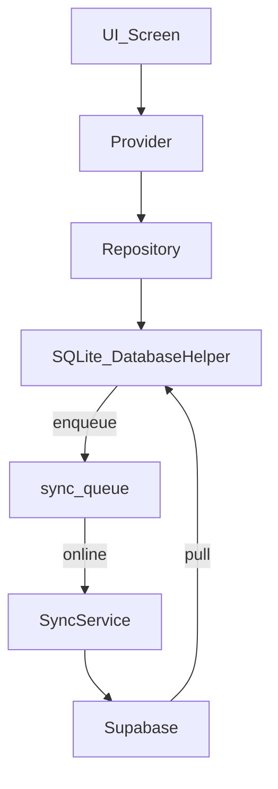

# Plan de stabilisation MVP (offline-first + sync Supabase)

## Contexte vérifié (code)

- **Navigation**: routes nommées limitées à l’onboarding dans [`lib/main.dart`](lib/main.dart) + beaucoup de `Navigator.push` (constaté via l’exploration).
- **IDs**: les modèles exposent déjà des IDs métier au format **`LP-YYYY-MM-XXX`**:
  - Lapin: `numeroIdentification` + générateur `Lapin.genererIdentifiant()` dans [`lib/models/lapin.dart`](lib/models/lapin.dart)
  - Lot: `identifiant` + `Lot.genererIdentifiant()` dans [`lib/models/lot.dart`](lib/models/lot.dart)
- **SQLite**: DB versionnée **27** avec tables et **FOREIGN KEY déclarées** (ex: `lapins.lot_id -> lots.id`) dans [`lib/services/database_helper.dart`](lib/services/database_helper.dart). Point critique: il n’y a pas d’`onConfigure` → **FK potentiellement non appliquées au runtime** (SQLite exige `PRAGMA foreign_keys=ON` par connexion).
- **Sync**: `SyncService` maintient une table `sync_queue` locale et pousse vers Supabase via [`lib/services/sync_service.dart`](lib/services/sync_service.dart). Point critique à verrouiller: le code fait `.eq('local_id', item.localId)` côté Supabase → on part sur votre choix **“UUID Supabase + `local_id` int”**.
- **UI**: Thème global défini dans [`lib/theme/app_theme.dart`](lib/theme/app_theme.dart) mais coexistence d’un **mode terrain** avec son propre `ThemeData` dans [`lib/utils/terrain_mode.dart`](lib/utils/terrain_mode.dart) + plusieurs AppBars (ex: [`lib/widgets/uniform_app_bar.dart`](lib/widgets/uniform_app_bar.dart)).

## Objectifs et règles (à imposer sans casser)

- **Offline-first**: SQLite = source de vérité locale. L’app doit rester utilisable réseau coupé.
- **IDs**:
  - **ID technique**: `id INTEGER` (SQLite) conservé.
  - **ID métier (visible)**: `LP-YYYY-MM-XXX` conservé (votre choix) pour Lapin et Lot.
  - **Jamais utiliser un champ texte libre (ex: nom) comme clé**.
- **Relations**:
  - Un Lapin ∈ 0..1 Lot (déjà modélisé via `lapins.lot_id` nullable) ; un Lot contient N lapins.
  - Toute relation doit être explicite (FK + validations applicatives + migrations safe).

## Phase A — Recensement complet (écrans, flux, dépendances)

Livrable: `docs/AUDIT_ECRANS.md`

- Scanner `lib/` pour lister **tous les écrans** (classes `*Screen/*Page`, routes, destinations `Navigator.push`), y compris utilitaires/oubliés.
- Pour chaque écran:
  - **Rôle métier**
  - **Données lues/écrites** (tables, providers, services)
  - **Dépendances** (providers/services/models/widgets)
- Sortir une **carte de navigation** (écrans principaux vs secondaires vs formulaires).

## Phase B — Audit données & schéma logique corrigé (critique)

Livrables: `docs/AUDIT_DONNEES.md` + schéma logique (pseudo-code)

- Extraire le schéma SQLite réel (tables/colonnes/FK/index) depuis [`lib/services/database_helper.dart`](lib/services/database_helper.dart).
- Inventorier les entités (minimum: Lapin, Lot, Événement, Reproduction, Traitement/Soin, Localisation/Cage) et aligner:
  - champs obligatoires vs optionnels
  - normalisation (JSON `metadata`/`actions`)
  - duplications (ex: `Lapin.localisation` vs `cageId`)
- Proposer un schéma logique cible (exemple):
```text
Lapin(local_pk:int, business_id:LP-YYYY-MM-XXX UNIQUE, lot_fk:int?, cage_fk:int?, ...)
Lot(local_pk:int, business_id:LP-YYYY-MM-XXX UNIQUE, cage_fk:int?, ...)
Event(local_pk:int, type, date, lapin_fk:int?, lot_fk:int?, ...)
Reproduction(Accouplement local_pk:int, male_fk:int, femelle_fk:int, ...)
Soin(local_pk:int, lapin_fk:int, medicament_fk:int?, ...)
Localisation(Batiment/Clapier/Cage) ...
Contraintes: Lapin.lot_fk nullable, mais si défini -> FK RESTRICT
```


## Phase C — Stabilisation Individuel & Lot (blocage MVP)

- Définir une politique claire:
  - opérations “par lot” (traitements en masse, inventaire, statut)
  - opérations “par individu” (repro, santé, décès, historique)
- Mettre des garde-fous:
  - pas de perte de données quand on ajoute/retire un lapin d’un lot
  - migrations non destructives pour les lapins existants sans lot

## Phase D — Offline + Sync Supabase (fiabilisation)

Livrable: `docs/SYNC_OFFLINE_FIRST.md`

- **Enforcer FK au runtime**: ajouter `onConfigure` (PRAGMA) au `openDatabase`.
- **Boucler la queue de sync**:
  - vérifier que chaque CRUD qui modifie SQLite **enfile** une entrée `sync_queue` (ou via `markDirty`).
- **Mapper SQLite ↔ Supabase** (UUID + `local_id`):
  - s’assurer que chaque payload envoyé à Supabase contient `local_id` (et `user_id`) + stratégie d’upsert.
  - définir la règle de conflit (au minimum last-write-wins + marquage `sync_conflict`).
  - ajouter une sync “down” (pull) minimale pour éviter les divergences inter-appareils.



## Phase E — UI/UX homogène (zéro overflow)

- Définir **un header unique** pour les écrans principaux (Dashboard/Cheptel/Repro/Santé/Plus) basé sur un composant central (s’appuyer sur [`lib/widgets/uniform_app_bar.dart`](lib/widgets/uniform_app_bar.dart) et l’`AppBarTheme` de [`lib/theme/app_theme.dart`](lib/theme/app_theme.dart)).
- Rendre le header **fixe** et le contenu scrollable (standardiser `Scaffold + body scrollable` ou `CustomScrollView` mais de façon cohérente).
- Ajouter une **icône de sync** (online/offline + pending) dans le header:
  - online/offline via `ConnectivityProvider`
  - pending via `SyncService.pendingCountStream` / `SyncProvider`
- Éliminer les overflows: audit systématique des `Row`/`Column` (Expanded/Flexible), SafeArea et tailles fixes.
- “Mode terrain”: décider comment il s’applique sans casser le thème global (au minimum éviter un second thème divergent).

## Phase F — Données fictives + tests + chasse aux bugs

- Ajouter un mécanisme de **seed** (dev uniquement) pour injecter:
  - dizaines de lapins, plusieurs lots, repro (accouplements/portées), soins, décès, tâches, finances, localisations
  - cas limites: lapin sans lot, lot vide, IDs manquants, dates incohérentes, très petits écrans
- Exécuter et compléter les tests existants dans `test/` (providers/models/services) et ajouter des tests ciblés sur:
  - règles Lapin↔Lot
  - génération/unicité des IDs métier
  - queue sync (enqueue→pending→synced)
  - écrans critiques sans overflow

## Phase G — Sécurité, non-régression, validation MVP

Livrables: `docs/CHECKLIST_MVP.md` + `docs/CHANGELOG_STABILISATION.md`

- Aucune suppression sans justification; migrations avec sauvegarde (export) et rollback si possible.
- Checklist finale:
  - offline complet
  - sync stable (si Supabase configuré)
  - données cohérentes (FK actives + validations)
  - UI homogène (header unique) + zéro overflow
  - liste des écrans “MVP ready”